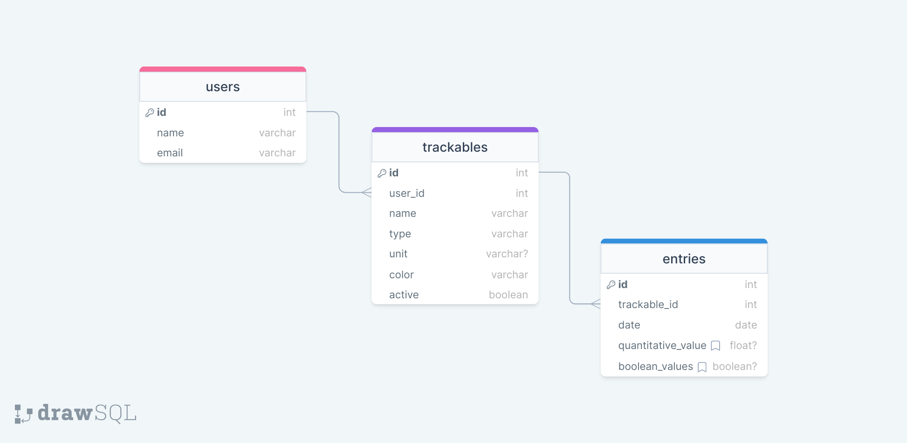

# U do U documentation
### Important!
This repo contains the frontend of the project.\
Don't forget to clone the [udou-server repo](https://github.com/vic-fb/udou-server) before getting started.

## Database schema

## API schema

You can find the API routes in [this document](https://docs.google.com/document/d/1zNp3uwuJBbnv7twVMUb_M4-jy7sNyfh65h0pRNqLdYA/edit?usp=sharing).

## Scripts

In the project directory, you can run:

### `npm install`
Get started by installing everything you need from the package.json

### `npm start`

Runs the app in the development mode.\
Open [http://localhost:3000](http://localhost:3000) to view it in your browser.

### `npm run lint`

Runs code styling fixes on all your JS files.\
You can learn more about ESlint [here](https://eslint.org/docs/latest/user-guide/getting-started)

## Learn More

You can learn more in the [Create React App documentation](https://facebook.github.io/create-react-app/docs/getting-started).

To learn React, check out the [React documentation](https://reactjs.org/).

[Here](https://styled-components.com/) you can learn about styled components.

To use Ant Design, check out the components documentation [here](https://ant.design/components/overview/).

To use Recharts, check out their [API](https://recharts.org/en-US/api) and [examples](https://recharts.org/en-US/examples).

## Other available scripts

### `npm test`

Launches the test runner in the interactive watch mode. This app has no tests yet.\
See the section about [running tests](https://facebook.github.io/create-react-app/docs/running-tests) for more information.

### `npm run build`

Builds the app for production to the `build` folder.\
It correctly bundles React in production mode and optimizes the build for the best performance.

The build is minified and the filenames include the hashes.\
Your app is ready to be deployed!

See the section about [deployment](https://facebook.github.io/create-react-app/docs/deployment) for more information.

### `npm run eject`

**Note: this is a one-way operation. Once you `eject`, you can't go back!**

If you aren't satisfied with the build tool and configuration choices, you can `eject` at any time. This command will remove the single build dependency from your project.
Instead, it will copy all the configuration files and the transitive dependencies (webpack, Babel, ESLint, etc) right into your project so you have full control over them. All of the commands except `eject` will still work, but they will point to the copied scripts so you can tweak them. At this point you're on your own.

You don't have to ever use `eject`. The curated feature set is suitable for small and middle deployments, and you shouldn't feel obligated to use this feature. However we understand that this tool wouldn't be useful if you couldn't customize it when you are ready for it.